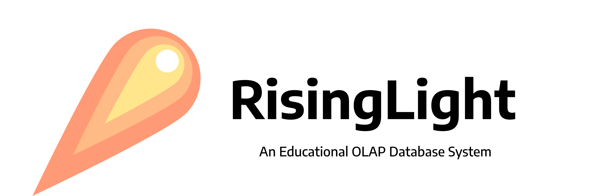

# RisingLight

[](https://github.com/risinglightdb/risinglight/actions)
[](https://dbdb.io/db/risinglight)
[](https://crates.io/crates/risinglight)
[](https://docs.rs/risinglight)



RisingLight is an OLAP database system for educational purpose. It is still in rapid development, and should not be used in production.

## Quick Start

Currently, RisingLight only supports Linux or macOS. If you are familiar with the Rust programming language, you can
start an interactive shell with:

```
cargo run           # start in debug mode
cargo run --release # or start in release mode
```

If you meet with any build issues, see [Install, Run, and Develop RisingLight](docs/00-develop.md) for more
information. We provide step-by-step guide on how to compile and run RisingLight from scratch.

After successfully building RisingLight, you may import some data and run SQL queries. See [Running TPC-H Queries](docs/01-tpch.md).

## Documentation

All documentation can be found in [docs](docs/) folder.

At the same time, dev docs are also available in `make docs` (latest) or [crates.io](https://docs.rs/risinglight) (stable).

## License

RisingLight is under the Apache 2.0 license. See the [LICENSE](LICENSE) file for details.

## Community

### Governance

See [GOVERNANCE](GOVERNANCE.md) for more information.

### Communication

The main communication channel for RisingLight developers is [GitHub Discussions].

### Other Messaging Apps

If you want to join our active communication group in messaging apps including Discord, Telegram, and WeChat, please send an email to `contact at risingwave-labs.com` with your user ID. We will then manually invite you to the group.

## Contributing

If you have a bug report or feature request, welcome to open an [issue](https://github.com/risinglightdb/risinglight/issues).

If you have any question to discuss, welcome to start a discussion on [GitHub Discussions].

If you want to contribute code, see [CONTRIBUTING](CONTRIBUTING.md) for more information. Generally, you will need to
pass necessary checks for your changes and sign DCO before submitting PRs. We have plenty of [good first issues](https://github.com/risinglightdb/risinglight/issues?q=is%3Aopen+is%3Aissue+label%3A%22good+first+issue%22). Feel free to ask questions either on GitHub or in our chat groups if you meet any difficulty.

## Acknowledgement

The RisingLight project was initiated by a group of college students who have special interests in developing database systems using modern programming technologies. The project is generously sponsored by [RisingWave Labs](https://www.risingwave-labs.com/), a startup innovating the next-generation database systems. RisingWave Labs is hiring top talents globally to build a cloud-native streaming database from scratch. If interested, please send your CV to `hr at risingwave-labs.com` .

Welcome to the RisingLight community!

[GitHub Discussions]: https://github.com/risinglightdb/risinglight/discussions
