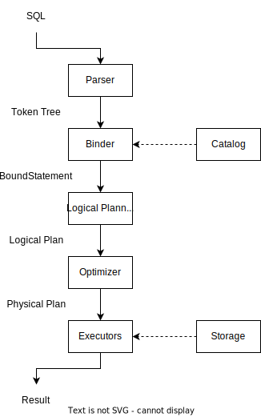

# The Lifecycle of a SQL: An Overview of RisingLight

As you have already known, RisingLight is an OLAP database system for educational purpose. Lite as RisingLight is, RisingLight shares a lot of architecture design in common with well-known database systems. In this article, we will introduce how a SQL is transformed into query result, by taking a look at the lifecycle of a SQL.

```sql
select a, sum(b) from t group by a;
```



## Before Queries...

RisingLight stores all information about tables and schemas in **catalog**. (See [`src/catalog`](../src/catalog) for more information). Catalog can be modified with `create table` and `drop table` statements.

```sql
create table t (a int, b int);
```

After that, the table will be created, and the table information will be stored in catalog. You may use `\dt` command to see how many tables are there in catalog, and their table IDs.

```plain
> \dt
| 0 | postgres | 0 | postgres | 18 | t |
```

## Parser

After the catalog gets filled, we can now start the real story of "the lifecycle of a SQL".

From the perspective of program, the SQL statement `select a, sum(b) from t group by a;` is just a sequence of characters. For the first step, we will need to transform the statement into something that the database system could read.

In RisingLight, we use [sqlparser-rs](https://github.com/sqlparser-rs/sqlparser-rs) to parse SQLs.

Parser will return an AST, which is a tree that represents users' query. For example, the above SQL will produce an AST like...

```rust
Query(
  Query {
    with: None,
    body: Select(
      Select {
        projection: [
          UnnamedExpr(
            Identifier(
              Ident {
                value: "a",
                quote_style: None,
              },
            ),
          ),
          UnnamedExpr(
            Function(
              Function {
                name: ObjectName(
                  [
                    Ident {
                      value: "sum",
                      quote_style: None,
                    },
                  ],
                ),
                args: [
                  Unnamed(
                    Expr(
                      Identifier(
                        Ident {
                          value: "b",
                          quote_style: None,
                        },
                      ),
                    ),
                  ),
                ],
                over: None,
                distinct: false,
              },
            ),
          ),
        ],
        into: None,
        from: [
          TableWithJoins {
            relation: Table {
              name: ObjectName(
                [
                  Ident {
                    value: "t",
                    quote_style: None,
                  },
                ],
              ),
              alias: None,
              args: [],
              with_hints: [],
            },
            joins: [],
          },
        ],
        group_by: [
          Identifier(
            Ident {
              value: "a",
              quote_style: None,
            },
          ),
        ],
      },
    ),
  },
)
``` 

Parser will tell us which statement type the SQL belongs, and have some basic information about the SQL query. For example, the above SQL is a **query**. The query is a **select**, which contains a **group by** clause on `a` variable, and operates on the `t` table. Inside the select list, there are two expressions `a` and `sum(b)`.

## Binder

The binder will figure out some basic information like which tables do each variable belongs. For example, which tables does the `a` and `b` in `select a, sum(b)` belong? Are they columns in table, or some other things? What types are they? Binder will analyze the AST from the parser, and **bind** such information. See [`src/binder`](../src/binder) for more information.

```rust
Select(
  BoundSelect {
    select_list: [
      Column #ColumnRefId { database_id: 0, schema_id: 0, table_id: 18, column_id: 0 },
      Sum([Column #ColumnRefId { database_id: 0, schema_id: 0, table_id: 18, column_id: 1 }]) -> Int32 (nullable) (agg),
    ],
    from_table: Some(
      JoinTableRef {
        relation: BaseTableRef {
          ref_id: 0.0.18,
          table_name: "t",
          column_ids: [
            0,
            1,
          ],
          column_descs: [
            ColumnDesc {
              datatype: Int32 (nullable),
              name: "a",
              is_primary: false,
            },
            ColumnDesc {
              datatype: Int32 (nullable),
              name: "b",
              is_primary: false,
            },
          ],
          is_internal: false,
        },
        join_tables: [],
      },
    ),
    where_clause: None,
    select_distinct: false,
    group_by: [
      Column #ColumnRefId { database_id: 0, schema_id: 0, table_id: 18, column_id: 0 },
    ],
  },
)
```

As seen above, the binder will bind `a` and `b` to their corresponding table (table `t`'s column `#0` and `#1`) and figure out the types (both `int` according to the catalog).

## Logical Planner

Now we have all necessary information about the query, and we can start to plan the query.

In database systems, there are a lot of logical operators. Here we list some:

* Projection: doing simple calculations. For example, `select a * 2 from table` will produce a projection plan for `a * 2`.
* Aggregation: aggregating over a list of data, and produce the result. For example, `sum(a)` will produce an aggregation plan.
* TableScan: scanning a full table. For example, `select * from table` will produce a table scan plan for scanning all data from `table`.
* Filter: apply filter condition. For example, the `where` clause.
* Join: join results from two executors. For example, `select * from a inner join b`.
* ...

The logical planner will do some simple mappings from bound statements to logical plans, so as to have a basic sketch of how this query will be processed. See [`src/logical_planner`](../src/logical_planner) for more information.

The example SQL will have the following logical plan, which is a simple DAG: `Projection <- Aggregate <- TableScan`.

```rust
LogicalProjection {
  project_expressions: [
    Column #ColumnRefId { database_id: 0, schema_id: 0, table_id: 18, column_id: 0 },
    InputRef #1,
  ],
  child: LogicalAggregate {
    agg_calls: [
      Sum([Column #ColumnRefId { database_id: 0, schema_id: 0, table_id: 18, column_id: 1 }]) -> Int32 (nullable),
    ],
    group_keys: [
      Column #ColumnRefId { database_id: 0, schema_id: 0, table_id: 18, column_id: 0 },
    ],
    child: LogicalTableScan {
      table_ref_id: 0.0.18,
      column_ids: [
        0,
        1,
      ],
      column_descs: [
        ColumnDesc {
          datatype: Int32 (nullable),
          name: "a",
          is_primary: false,
        },
        ColumnDesc {
          datatype: Int32 (nullable),
          name: "b",
          is_primary: false,
        },
      ],
      with_row_handler: false,
      is_sorted: false,
      expr: None,
    },
  },
}
```

## Optimizer (and Physical Planner)

Now we will need to figure out which executor should be used for each logical plan. For example,

* Use hash aggregator, simple aggregator or sort aggregator for `LogicalAggregate`? We can determine this based on whether we have `group by` clause, and whether the input is sorted.
* Use nested loop join or hash join for `LogicalJoin`? We can determine by whether the input has join key (or equal join condition), and whether the join type is inner join.

At the same time, the optimizer will also eliminate unnecessary projections, do constant folding (e.g. `a + 1 + 2 -> a + 3`), and do filter scan and filter push-down optimizations.

Here we have two examples:

```sql
select * from a inner join b where a.x > 10;
```

For the join statement, if we can have fewer data from each join side, we can generally execute faster. Therefore, the *filter join* rule will move the filter under the join executor:

```plain
Join
/  \
|  B
|
Filter
|
A
``` 

So as to accelerate the query.

Another example is the *filter scan* rule. In RisingLight, the storage layer supports a functionality called *filter scan*. Developers can provide a filter condition to the table scan executor, and rows not matching the filter condition will be automatically filtered away at the storage layer (instead of having a separate filter executor).

The *filter scan* rule will automatically merge a filter plan node and a table scan node, apply the filter condition to the table scan node, and produce a single `TableScan` node.

In a nutshell, in RisingLight, the optimizer will transform while optimizing the logical plan into a physical plan. See [`src/optimizer`](../src/optimizer) for more information. The example SQL will produce the following physical plan: `PhysicalProjection <- PhysicalHashAgg <- PhysicalTableScan`. Note that as physical nodes have almost identical information to logical nodes, we store information of logical nodes inside physical nodes as `logical` variable. Despite their existence inside physical plans, after all, the following tree only contain physical nodes.

```rust
PhysicalProjection {
  logical: LogicalProjection {
    project_expressions: [
      InputRef #0,
      InputRef #1,
    ],
    child: PhysicalHashAgg {
      logical: LogicalAggregate {
        agg_calls: [
          Sum([InputRef #1]) -> Int32 (nullable),
        ],
        group_keys: [
          InputRef #0,
        ],
        child: PhysicalTableScan {
          logical: LogicalTableScan {
            table_ref_id: 0.0.18,
            column_ids: [
              0,
              1,
            ],
            column_descs: [
              ColumnDesc {
                datatype: Int32 (nullable),
                name: "a",
                is_primary: false,
              },
              ColumnDesc {
                datatype: Int32 (nullable),
                name: "b",
                is_primary: false,
              },
            ],
            with_row_handler: false,
            is_sorted: false,
            expr: None,
          },
        },
      },
    },
  },
}
```

## Execution

After the long planning phase, we can finally construct executors based on physical plans, and start feeding data into the executors. This part of code lies in [`src/executor`](../src/executor/).

Each physical plan node corresponds to an executor, and the `ExecutorBuilder` builds the executor tree from the physical plan nodes.

In RisingLight, we use [futures-async-stream](https://github.com/taiki-e/futures-async-stream) to write execution logics. The crate helps us write clear execution logic in a stream way. The executors will be composed into a single stream: `impl Stream<Item = Result<DataChunk>>`, and the stream will be polled by the main thread. After some time, the query result will be available, and will be displayed in users' SQL shell.

## Summary

That's the end of the lifecycle of a SQL query in RisingLight. To summarize,

* Parser: Parse the SQL string into an Abstract Syntax Tree (AST).
* Binder: Resolve all expressions referring with their names.
* Logical Planner: Transform the parse tree into a logical operations tree.
* Optimizer: Do query optimization and generate physical plans.
* Executor: Execute the queries.

Looking for some challenges in RisingLight? Just pick some [good first issues](https://github.com/risinglightdb/risinglight/issues) and follow the [contribution guide](../CONTRIBUTING.md). Also welcome to join our Slack community, please refer to [readme](../README.md) for more information.

The RisingLight storage is also interesting to learn. [An Overview of RisingLight Storage](04-storage-overview.md) will give more insights on it.
