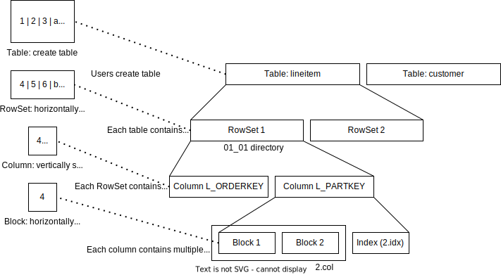
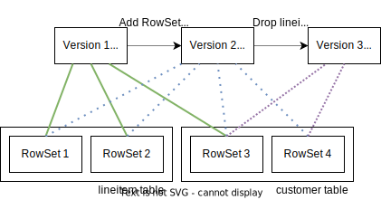

# An Overview of RisingLight Storage

RisingLight implements a merge-tree based column storage engine called ***secondary***. The code is in
[`src/storage`](https://github.com/risinglightdb/risinglight/blob/main/src/storage/).

## Data Organization

*Secondary* uses a layered structure to store data on disk. Each user table created with `create table` statement corresponds to a merge-tree. Inside a merge tree, there are multiple RowSets, each of them occupying a directory under the RisingLight database directory. Inside each RowSet, there are multiple column and sparse index files.

If you followed the guide of [Running TPC-H Queries](01-tpch.md), you will find a `risinglight.secondary.db` directory under the project root. The directory structure is like...

<details>

<summary>tree risinglight.secondary.db</summary>

```
risinglight.secondary.db
├── 0_1
│   ├── 0.col
│   ├── 0.idx
│   ├── 1.col
│   ├── 1.idx
│   ├── 2.col
│   ├── 2.idx
│   ├── 3.col
│   └── 3.idx
├── 1_5
│   ├── 0.col
│   ├── 0.idx
│   ├── 1.col
│   ├── 1.idx
│   ├── 2.col
│   └── 2.idx
├── 2_3
│   ├── 0.col
│   ├── 0.idx
│   ├── 1.col
│   ├── 1.idx
│   ├── 2.col
│   ├── 2.idx
│   ├── 3.col
│   ├── 3.idx
│   ├── 4.col
│   ├── 4.idx
│   ├── 5.col
│   ├── 5.idx
│   ├── 6.col
│   ├── 6.idx
│   ├── 7.col
│   ├── 7.idx
│   ├── 8.col
│   └── 8.idx
├── 3_6
│   ├── 0.col
│   ├── 0.idx
│   ├── 1.col
│   ├── 1.idx
│   ├── 2.col
│   ├── 2.idx
│   ├── 3.col
│   ├── 3.idx
│   ├── 4.col
│   ├── 4.idx
│   ├── 5.col
│   ├── 5.idx
│   ├── 6.col
│   └── 6.idx
├── 4_4
│   ├── 0.col
│   ├── 0.idx
│   ├── 1.col
│   ├── 1.idx
│   ├── 2.col
│   ├── 2.idx
│   ├── 3.col
│   ├── 3.idx
│   ├── 4.col
│   └── 4.idx
├── 5_0
│   ├── 0.col
│   ├── 0.idx
│   ├── 1.col
│   ├── 1.idx
│   ├── 2.col
│   ├── 2.idx
│   ├── 3.col
│   ├── 3.idx
│   ├── 4.col
│   ├── 4.idx
│   ├── 5.col
│   ├── 5.idx
│   ├── 6.col
│   ├── 6.idx
│   ├── 7.col
│   └── 7.idx
├── 6_2
│   ├── 0.col
│   ├── 0.idx
│   ├── 1.col
│   ├── 1.idx
│   ├── 2.col
│   ├── 2.idx
│   ├── 3.col
│   ├── 3.idx
│   ├── 4.col
│   ├── 4.idx
│   ├── 5.col
│   ├── 5.idx
│   ├── 6.col
│   ├── 6.idx
│   ├── 7.col
│   ├── 7.idx
│   ├── 8.col
│   └── 8.idx
├── 7_10
│   ├── 0.col
│   ├── 0.idx
│   ├── 1.col
│   ├── 1.idx
│   ├── 10.col
│   ├── 10.idx
│   ├── 11.col
│   ├── 11.idx
│   ├── 12.col
│   ├── 12.idx
│   ├── 13.col
│   ├── 13.idx
│   ├── 14.col
│   ├── 14.idx
│   ├── 15.col
│   ├── 15.idx
│   ├── 2.col
│   ├── 2.idx
│   ├── 3.col
│   ├── 3.idx
│   ├── 4.col
│   ├── 4.idx
│   ├── 5.col
│   ├── 5.idx
│   ├── 6.col
│   ├── 6.idx
│   ├── 7.col
│   ├── 7.idx
│   ├── 8.col
│   ├── 8.idx
│   ├── 9.col
│   └── 9.idx
├── 7_7
│   ├── 0.col
│   ├── 0.idx
│   ├── 1.col
│   ├── 1.idx
│   ├── 10.col
│   ├── 10.idx
│   ├── 11.col
│   ├── 11.idx
│   ├── 12.col
│   ├── 12.idx
│   ├── 13.col
│   ├── 13.idx
│   ├── 14.col
│   ├── 14.idx
│   ├── 15.col
│   ├── 15.idx
│   ├── 2.col
│   ├── 2.idx
│   ├── 3.col
│   ├── 3.idx
│   ├── 4.col
│   ├── 4.idx
│   ├── 5.col
│   ├── 5.idx
│   ├── 6.col
│   ├── 6.idx
│   ├── 7.col
│   ├── 7.idx
│   ├── 8.col
│   ├── 8.idx
│   ├── 9.col
│   └── 9.idx
├── 7_8
│   ├── 0.col
│   ├── 0.idx
│   ├── 1.col
│   ├── 1.idx
│   ├── 10.col
│   ├── 10.idx
│   ├── 11.col
│   ├── 11.idx
│   ├── 12.col
│   ├── 12.idx
│   ├── 13.col
│   ├── 13.idx
│   ├── 14.col
│   ├── 14.idx
│   ├── 15.col
│   ├── 15.idx
│   ├── 2.col
│   ├── 2.idx
│   ├── 3.col
│   ├── 3.idx
│   ├── 4.col
│   ├── 4.idx
│   ├── 5.col
│   ├── 5.idx
│   ├── 6.col
│   ├── 6.idx
│   ├── 7.col
│   ├── 7.idx
│   ├── 8.col
│   ├── 8.idx
│   ├── 9.col
│   └── 9.idx
├── 7_9
│   ├── 0.col
│   ├── 0.idx
│   ├── 1.col
│   ├── 1.idx
│   ├── 10.col
│   ├── 10.idx
│   ├── 11.col
│   ├── 11.idx
│   ├── 12.col
│   ├── 12.idx
│   ├── 13.col
│   ├── 13.idx
│   ├── 14.col
│   ├── 14.idx
│   ├── 15.col
│   ├── 15.idx
│   ├── 2.col
│   ├── 2.idx
│   ├── 3.col
│   ├── 3.idx
│   ├── 4.col
│   ├── 4.idx
│   ├── 5.col
│   ├── 5.idx
│   ├── 6.col
│   ├── 6.idx
│   ├── 7.col
│   ├── 7.idx
│   ├── 8.col
│   ├── 8.idx
│   ├── 9.col
│   └── 9.idx
├── dv
└── manifest.json
```

</details>

Each RowSet has a directory, whose name is `<table_id>_<rowset_id>`. Inside the RowSet directory, there are `*.col` and `*.idx` files. That's the basic organization of on-disk data storage of RisingLight.



## Catalog and Manifest

RisingLight implements snapshot read using a file-based snapshot. A consistent snapshot of the whole database is called a **version**, which contains a RowSet list, a deletion vector list (will be introduced in later sections), and a table catalog.

For example, in the figure, we are applying two operations on the storage: add RowSet 4 (in table customer), and then drop table lineitem. These two operations will produce two versions respectively, where **each version is a consistent snapshot of the whole database**.



These operations will be recorded in `manifest.json` epoch by epoch. One epoch can contain multiple operations (like add RowSet, create table, etc.). When RisingLight restarts, it will read the manifest file and recover the latest snapshot of the database, while cleaning up unused files.

## Write Path

Write is initiated by [`InsertExecutor`](https://github.com/risinglightdb/risinglight/blob/main/src/executor/insert.rs) or [`DeleteExecutor`](https://github.com/risinglightdb/risinglight/blob/main/src/executor/delete.rs) (and in the future, `UpdateExecutor`).

The executor will start a write transaction, then appending data chunks into the transaction. Inside transaction structure, RisingLight will maintain a memtable (in BTree or just a vector based on whether the data needs to be sorted) during the transaction. When executors commit a transaction, memtable will be encoded into RowSets, written to disk, and added into the manifest.

The public interface (like `Transaction`, `Table`) is defined in [`storage/mod.rs`](https://github.com/risinglightdb/risinglight/blob/main/src/storage/mod.rs). Simple as the interface looks like, there are a lot of things going on internally in *secondary*.

The data chunk from `InsertExecutor` will be piped into `RowsetBuilder`, where data from each column will be fed into `ColumnBuilder`. `ColumnBuilder` will decide how many items a block contains, and pipe the data into `BlockBuilder`. `Block` is the minimum managing unit of *secondary*. Each block will occupy an entry in block cache. `ColumnBuilder` will also build a sparse index for the column, which contains the begin offset of each block in the `.col` file, and the first key of each block (if it is a sorted column).

## Read Path

[`TableScanExecutor`](https://github.com/risinglightdb/risinglight/blob/main/src/executor/table_scan.rs) will read from the storage. It will start a read transaction, and get data chunks from the storage.

Also there are a lot of things going on internally in *secondary*. Upon starting the read transaction, *secondary* will take a snapshot of the on-disk merge tree structure by pinning the latest storage *version*. If a version is pinned, the files in that version won't be deleted (or more professionally speaking, vacuumed), and executors can read from those files safely.

A table will typically contain multiple RowSets. *Secondary* will create an iterator over multiple RowSets either by using `MergeIterator` (to do a merge sort), or by using `ConcatIterator` (by yielding data one RowSet by RowSet). Under those iterators, there is one of the most fundamental and important iterator, `RowSetIterator`. `RowSetIterator` scans the underlying columns by using `ColumnIterator`, which uses `BlockIterator` internally. It will also take delete vectors into consideration, so as to filter out deleted rows.

`RowSetIterator` also supports filter scan. Users can provide a filter expression to `RowSetIterator`, and the iterator will skip reading blocks to reduce I/O.

There is a special column called `RowHandler` in *secondary*. This column is of int64 type, which contains RowSet id on upper 32 bits, and row offset in lower 32 bits. For example, if there is a table, which contains a RowSet with the following data:

```
RowSet #2
Column 1 | Column 2
       1 |        1
       1 |        2
       1 |        3
```

When reading from the table, we can scan an extra implicit column `RowHandler`:

```
RowSet #2
RowHandler  | Column 1 | Column 2
2 << 32 + 1 |        1 |        1
2 << 32 + 2 |       1 |        2
2 << 32 + 3 |       1 |        3
```

The `RowHandler` will be used in deletions.

## Deletions

`DeleteExecutor` will start an update transaction. It will first scan a table with given delete condition, along with the `RowHandler` column. Then, it will call `delete` on transaction, providing the `RowHandler` as parameter. Those `RowHandler` will be flushed into a delete vector file, and added to the manifest.

## Statistics

RisingLight implements block-level [statistics](https://github.com/risinglightdb/risinglight/tree/main/src/storage/secondary/statistics) when building RowSet. It supports distinct values and row count for each block. As the statistics don't take deletions into account, developers should keep in mind that the statistics is not accurate. For example, row count in statistics might be larger than actual rows.

## Compaction and Vacuum

There's a background compaction thread in *secondary*. As users continuously operate on the database, there might be:
* Multiple small RowSets. Every `insert` produces one `RowSet` in RisingLight. Having too many small RowSets might impact read performance.
* Garbage in RowSets. When there's a delete operation, *secondary* will only write a delete vector instead deleting the real data in RowSets. We need to clean them up by compaction.

Whenever there's an update to the manifest, compaction picker will pick some RowSets to compact. It will read all contents out of the RowSets, and produce zero or one or multiple new RowSets. When the compaction is completed, the compactor will record the operation in manifest.

Compaction cannot be done together with delete transactions, as the delete vector only records `<RowSet id, row offset>`. If the compactor is doing the compaction using the current set of delete vectors, while new delete vectors are being added in, those DVs will be ignored throughout the compaction process. Therefore, *secondary* doesn't allow compaction and deletion to be running together.

When a *version* is not used by any executor, the vacuum thread will begin to delete unused files in that version. 