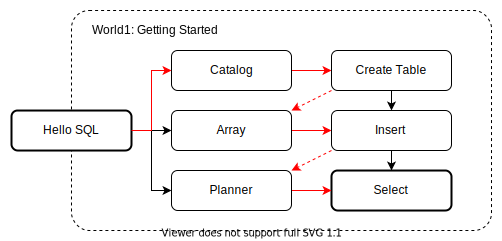

# 入门

欢迎来到新手村！

在这里我们将白手起家，构建出一个能够运行简单 SQL 语句的数据库框架。
在此过程中，我们会从一个 Parser 开始，逐步引入查询引擎所需的 Binder，Planner，Executor 等模块。
最终实现数据库的 3 条基本命令：创建 `CREATE`，插入 `INSERT` 和查找 `SELECT`。

## 世界地图

1. Hello，SQL：实现最简单的 SQL 解释器。

2. Catalog：定义 Catalog 相关数据结构。

3. 创建表：实现 Binder。支持 `CREATE TABLE` 语句。

4. 内存存储：实现分析型数据库特有的列式存储数据结构。

5. 插入数据：向表中插入数据，支持 `INSERT VALUES` 语句。

6. 执行计划：实现 Plan Node，支持 `EXPLAIN` 语句。

7. 查询数据：从表中读取数据，支持 `SELECT v FROM t` 语句。

除此之外，还有以下小练习：

8. 删除表：支持 `DROP TABLE` 语句。

9. 创建 Schema：支持 `CREATE SCHEMA` 语句。

从新手村成功毕业以后，我们就有了探索其他世界所需的代码基础。
